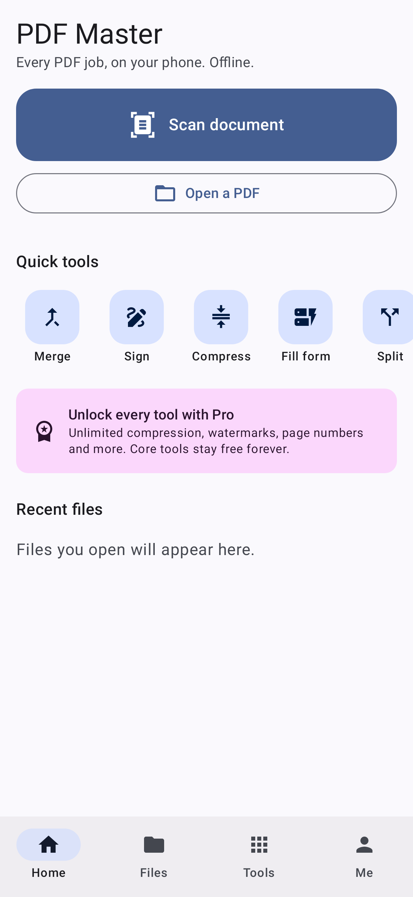
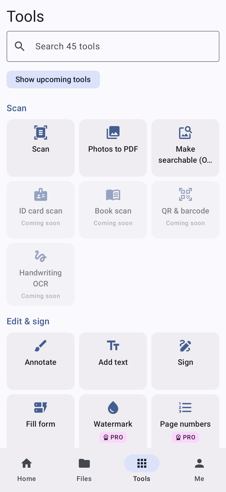
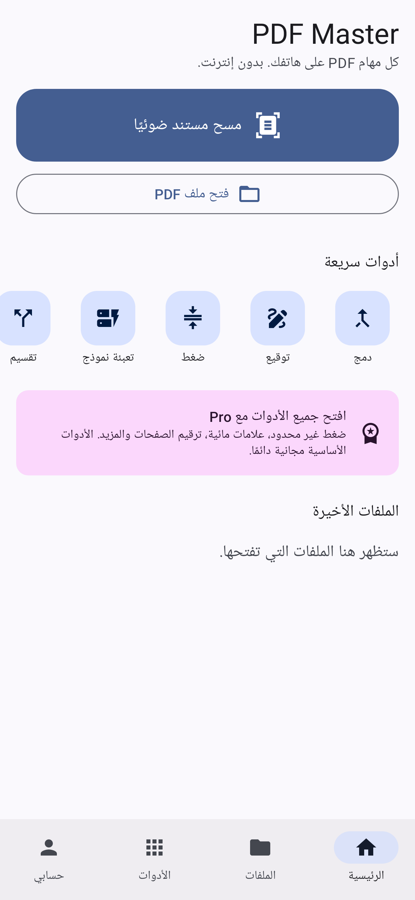

# PDF Master (Android)

Offline-first PDF app for Android 8.0+ (API 26). Kotlin, Jetpack Compose, Material 3.
This repository holds **Phase 1 (free-core MVP)** of the product spec.

| Home | Tools | Arabic (RTL) |
| --- | --- | --- |
|  |  |  |

## What is built

| Area | Shipped in this build |
| --- | --- |
| Scan | ML Kit Document Scanner (edge detection, auto-capture, crop, clean-up), gallery import, review screen (reorder, rotate, delete), filters (magic colour, greyscale, B/W with Otsu threshold, high-contrast text), on-device OCR → searchable PDF, auto-naming from page text |
| Viewer | Renders on demand with the platform PDFium renderer (1,000+ page files), continuous or single page, pinch zoom, night/sepia, full-text search with highlighted hits, contents/outline, bookmarks, thumbnails, go to page, read aloud with speed control, print, opens password-protected files |
| Annotate | Pen, highlighter, highlight area, underline, strikethrough, text, rectangle, ellipse, arrow, eraser, colours and widths, unlimited undo/redo |
| Sign | Draw / type / photo signatures and initials (stored AES-GCM encrypted with a Keystore key), place, drag, resize, date stamp, apply to all pages |
| Forms | Reads and fills AcroForm text, checkbox, radio and choice fields; auto-fill from an encrypted profile; strips hybrid XFA so Adobe Reader shows the values; flatten (Pro) |
| Organise | Merge PDFs + images (drag to order), split by ranges / every N / bookmarks, extract pages, organise grid (reorder, rotate, delete, duplicate, insert blank, insert from PDF, extract selection) |
| Convert / optimise | Compress with presets or a target size (free 3/day), greyscale, PDF → JPG/PNG at chosen DPI, PDF → text (Pro) |
| Security | Protect with AES-256 and permissions (Pro, one free try), remove password, remove hidden data (Pro), biometric app lock |
| Files | Library with recents, stars, rename, undoable delete, full-text search across all PDFs (Room FTS4), version history on overwrite, share / save to device, share-sheet and "Open with" entry |
| Money | Google Play Billing (monthly, yearly with trial, lifetime), Pro badge and paywall shown **before** a tool opens, one free trial use per Pro tool, cached entitlement for offline use |
| Language | English and Arabic with full right-to-left layout; per-app language on Android 13+ |

The tool hub lists all 45 planned tools; the ones from later phases are shown as "Coming soon"
with their roadmap phase.

### Privacy guarantees enforced in code
- The manifest **removes `android.permission.INTERNET`**, so no free tool can make a network call.
- Backups exclude documents, signatures and the profile.
- Originals are never modified until the user chooses *Overwrite*; the previous content is
  kept as a restorable version. All writes go to a temp file and are swapped in atomically.

## Build and test

Requires JDK 17+ and the Android SDK (platform 35).

```bash
./gradlew :app:assembleDebug          # debug APK
./gradlew :app:testDebugUnitTest      # 47 JVM tests (Robolectric)
./gradlew :app:lintDebug
```

The tests cover page-range parsing, page-rotation geometry, crash-safe writes, auto-naming,
profile matching, the real PdfBox engine (merge 5 files, extract 3–7, reorder/rotate/duplicate,
AES-256 protect and unlock, form fill with XFA removal, search hit positions, OCR text layers,
compression, stamping, overlays), and UI smoke tests that launch the app in English and Arabic.

Release size: about **17 MB** for an arm64 device (App Bundle splits per ABI). The bundled
ML Kit OCR library is most of that.

## Architecture

```
ui/          Compose screens: home, files, tools, viewer, organise, scan review, me
billing/     Tool catalogue, entitlements (pre-entry gating), Play Billing
pdf/         PdfOps (PdfBox-Android, Apache 2.0), FormOps, PageRenderer (PDFium), fonts
ocr/         ML Kit Text Recognition v2 (bundled model), auto-naming
data/        Room library + FTS index, prefs, encrypted signature and profile stores
core/        Page ranges, page geometry, safe file writes, Keystore crypto
```

Dependencies are wired by hand in `AppContainer` rather than Hilt, to keep the build small.

## Known gaps in Phase 1

- **Not yet run on a physical device or emulator.** It is verified by compilation, lint, unit and
  Robolectric UI tests only. The camera scanner, PDF rendering, billing and biometrics need a
  real device pass before beta.
- OCR recognises Latin script only (ML Kit v2). Arabic OCR needs Tesseract or another engine.
- Annotations are burned into the page content, not saved as editable PDF annotation objects;
  there is no comments list yet.
- Text typed in Arabic and other complex scripts is placed as an image (Android shapes it
  correctly, but it is not selectable text).
- Long jobs run in the app process, not a foreground-service notification.
- Stylus pressure, split-screen two-PDF view, and widgets / quick-settings tile are not built.
- Play product IDs (`pdfmaster_pro_monthly`, `pdfmaster_pro_yearly`, `pdfmaster_pro_lifetime`)
  must be created in Play Console.

Phase 2 (text editing, redaction, Office conversion, PAdES) needs the commercial PDF SDK
decision described in the spec.
